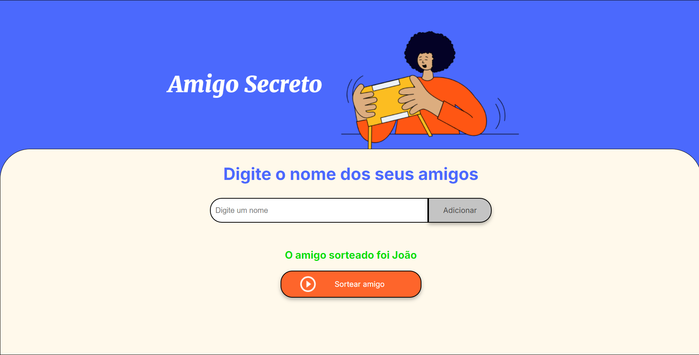

# ONE - Desafio Amigo Secreto

Repositório destinado ao desafio do curso inicial de programação do Oracle ONE.

## Sobre o projeto

Uma aplicação simples para gerenciar e sortear amigos para um evento de amigo secreto. Os usuários podem adicionar os nomes dos participantes, visualizar a lista de amigos e realizar o sorteio de forma prática.

## Tecnologias Utilizadas

- **HTML**: Estruturação da página.
- **CSS**: Estilização da aplicação (arquivo externo `style.css`).
- **JavaScript**: Lógica para adicionar amigos, sortear e manipular o DOM.

## Acesse a aplicação

**Você pode acessar a aplicação pelo [link](https://lucas-p00.github.io/ONE-desafio-amigo-secreto/).**
